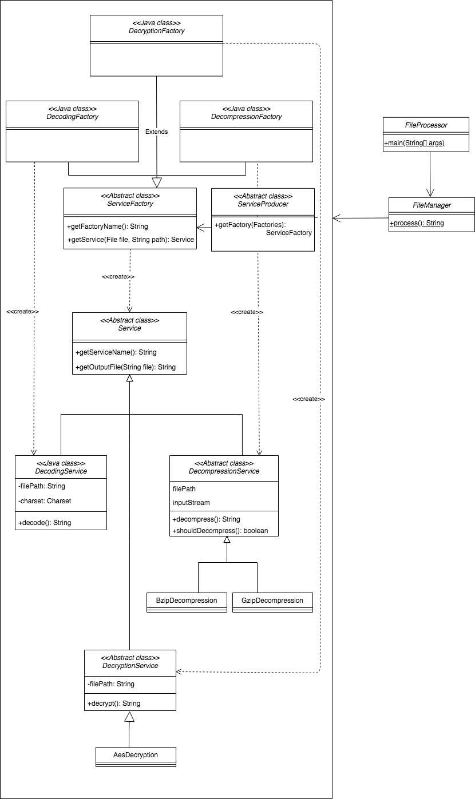
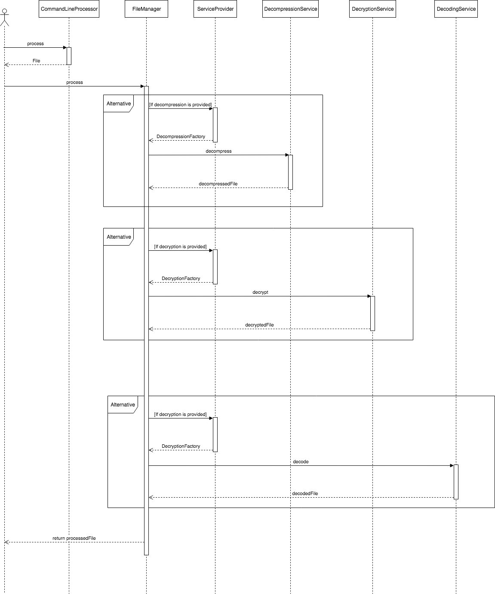

# FileReader

### What does this do?
This is an exercise in software design, which reads a file and applies decompression, decryption and decoding.  

To run the program, please navigate to `FileProcessor.java` in `java` > `com.sanjana`

### Usage
| Operation     | Supported values      |       
| ------------- |---------------------- |
| Compression   | `gzip`, `bzip`        |
| Encryption    | `aes128`              |
| Encoding      | `utf-8`, `iso-8859-1` |

Examples - 
1. `java FileProcessor file=TestData/GzipEncrypted.txt.gz compression=gzip encryption=aes128 secret=tellmeyoursecret charset=utf-8`  
This attempts to read a file at `TestData/GzipEncrypted.txt.gz`, decompresses it from `gzip`, decrypts the file using the AES128 algorithm and the private key `tellmeyoursecret`, and finally decodes the text file in `UTF-8`
2. `java FileProcessor file=TestData/EncryptedText.txt encryption=aes128 secret=tellmeyoursecret charset=utf-8`  
This attempts to read a file at `TestData/EncryptedText.txt`, decrypts the file using the AES128 algorithm and the private key `tellmeyoursecret`, and finally decodes the text file in `UTF-8`
3. `java FileProcessor file=TestData/PlainText.txt`  
This opens the file at `TestData/PlainText.txt` and returns is as no operations take place
4. `java FileProcessor file=TestData/BzipUnencrypted.tar.bz2 compression=bzip`  
This opens the file at `TestData/BzipUnencrypted.tar.bz2` and decompresses it from `bzip` and writes it to a new location  
  
Processed files will be written to the *root directory of the project* with the name starting with the operation last performed on the file.  
For example, if the file is being decompressed and decoded, the final output will reside in a file named `Decoding_2019-01-02.txt`  
Example files can be found in the `TestData` folder

### Design
The core of the operations happen in the `FileManager` class in the `file` folder under `com.sanjana`.  
The file manager checks if the file needs to be decompressed, decrypted and decoded in sequence and calls an *_Abstract Factory_* to return an instance of a factory for the operation at hand.  
The concrete factory returns a concrete type of the *_Service_* abstract class. The concrete instance of the _Service_ class performs the actual operation using the `decode()`, `decrypt()` and `decompress()` methods  
Once file has been processed, the FileManager returns the path relative to the root of the project where the new file is written

The class diagram is as follows -   
  
  
  
The sequence diagram is -
  

### Rationale
The project adopts the creational patterns of an Abstract Factory to ease out managing the different inputs and attributes to be set while creating instances of the services.
The client, here represented by the `FileManager` simply calls the static `process` method with a `com.sanjana.file.File` object loaded with the config provided via the command line and hopes to receive the location of the newly created file.
At every step, the FileManager makes a request to the ServiceProducer, with an option to pick which concrete factory to return.  

The concrete factory then takes the file and a String representing the location of the intermediate file which gets created between operations and returns an instance of the abstract `Service` class.  
Each concrete Service object then performs the operation needed and returns the location of a newly created file with the contents being the file data after the operation has occurred. 

This allows us to easily add new features to the list of file operations, say if we want to add a feature to re-encrypt the file after decoding before saving, we will need to create a new Service implementation with say, a `reencrypt` method and a factory
which will give us a concrete ReencryptService object which will be used in sequence in the FileManager object.  

Extra encoding, compression and encryption support can be added to the existing system by extending the required Service class and registering them in the concrete factory in the `getService` method.

### Assumptions and scope for future improvements
1. Encryption requires the `secret` parameter be passed with the private key used as the value as we are using asymmetric encryption here.
2. Logging can be hooked to an Elk-like service and can be streamlined to have an application-specific logger which inherits from the Logger in log4j. Currently each class which needs logging instantiates it inside the class body
3. The dynamic loading of the modules here is slightly restricted by the JVM as adding classes to the ClassLoader at runtime is restricted and encapsulation is bypassed. This has been attempted in the `modularization` branch in the `ServiceProducer` class where the services are obtained via the ClassLoader and are invoked using reflection.  
A truly dynamic loading straight from the file system can be realized in a language like Ruby by using the `load` method of the `Kernel` class which loads a file into a variable on which the `send` method can be invoked.
4. Input and output files can be locked when they are being read/written to prevent edits while they are being processed.